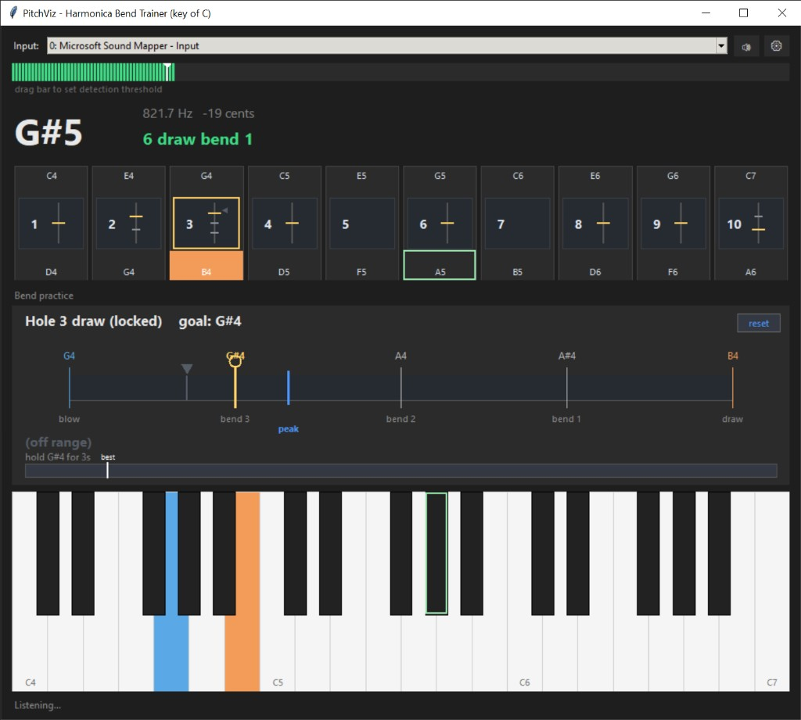
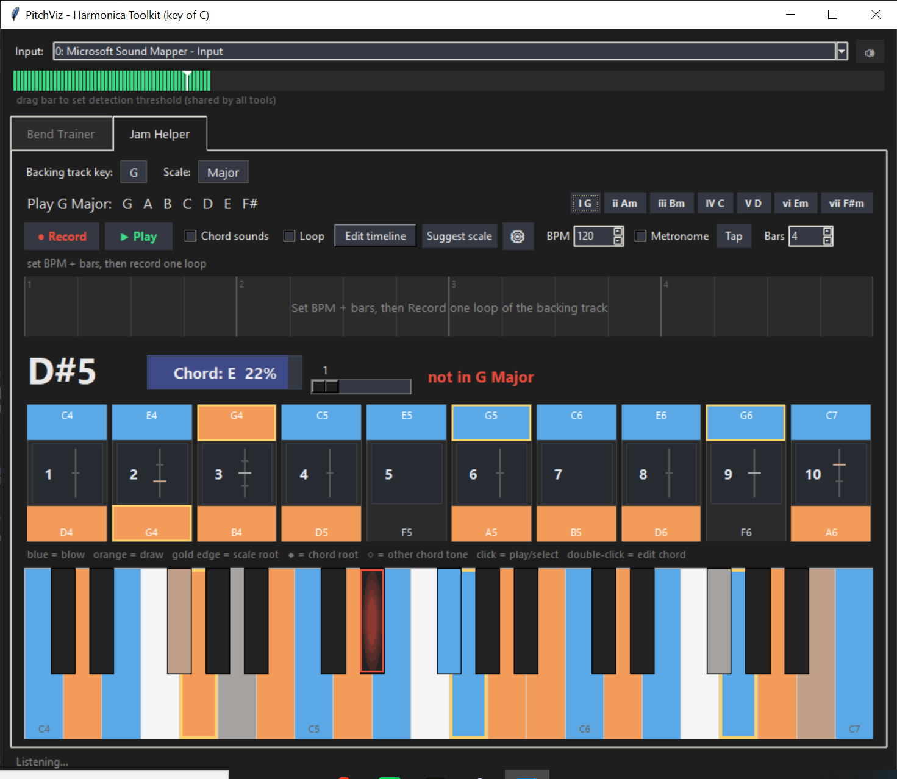

# PitchViz

A small desktop **harmonica toolkit** (key of **C**). It listens to your mic and
hosts a set of tools as tabs:

- **Bend Trainer** - shows the note you're playing, the bends you can reach, and
  how close you are to hitting and holding them.
- **Jam Helper** - pick a backing-track key + scale and it shows which notes to
  play (and which need bends), whether the note you're playing fits, and the
  backing chords on the harmonica and piano.

Target instrument: standard 10-hole diatonic harmonica, key of **C**.





## Quick start

Requires Python 3.10+.

```powershell
python -m venv .venv
.\.venv\Scripts\Activate.ps1
python -m pip install -r requirements.txt
python run.py
```

(`tkinter` ships with Python, so there's nothing else to install. You can also
launch with `python -m pitchviz`.)

## How to use it

- **Tabs** (top): switch between tools. The shared input bar and level meter
  apply to whichever tool is open.
- **Input level** (top): drag the marker to set the detection threshold (how
  loud a sound must be before it's detected).

### Bend Trainer

- **Harmonica diagram**: click a hole's **top** to hear its blow note, **bottom**
  for its draw note, or the **middle (lock button)** to lock that hole for
  practice. The lock button shows the hole number and a mini bend-bar.
- **Bend practice panel** (main view): the hole shown as a ladder from blow
  (blue) to draw (orange) with the bend targets in between.
  - A marker follows your pitch; the **peak** line shows your current bend depth.
  - Click a target to set it as your **goal** and hear it.
  - Hold the goal in tune for a few seconds to score a **success** (chime +
    teal). The **hold bar** tracks your best attempt. Progress is recorded only
    while a hole is **locked**.
- **Piano**: shows the detected note (outline) and the selected hole's blow/draw
  keys. Hovering a note anywhere highlights it everywhere.
- **Mute** (top bar) silences playback; the **gear** (in the tab) opens settings
  (peak inertia, marker smoothing, hold-to-succeed seconds, reset all).

### Jam Helper

- Pick the **backing track key** and a **scale** (Major, Minor, Major/Minor
  pentatonic, Blues). The recommended notes light up on the piano and harmonica
  in the breath colors (**blue = blow**, **orange = draw**), with a **gold edge**
  marking the **root**. Bend ticks in a hole's middle show which scale notes you
  reach by bending, and a live needle tracks your exact pitch so you can see when
  you're *between* notes.
- As you play, every reed that makes the note is outlined **green** if it fits
  the scale (so duplicates like 2-draw / 3-blow light together), **red** if not.
- Use the progression recorder to detect backing chords into a timeline. Chords
  can be snapped to the selected key/scale, edited manually, cleared into silent
  pauses, and played back with optional chord sounds and metronome clicks.
- Chord tones are marked on the harmonica and piano; detected live notes also
  get an in-box spotlight so root outlines do not hide the detection.
- **Click a bend tick** to jump straight to the Bend Trainer, locked on that
  hole with the bend set as your goal.

## Project layout

The app is a tabbed shell that hosts independent tools. Code is split so tools
are easy to add or remove.

```
run.py                  # entry point (python run.py)
pitchviz/
  shell.py              # window + tab bar; owns the shared audio engine
  core/                 # shared, GUI-free logic
    audio.py            #   mic engine (one input stream for all tools)
    pitch.py            #   pitch detection + note math
    harmonica.py        #   C-harmonica note/hole/bend mapping
    music.py            #   keys, scales, diatonic chords
    synth.py            #   tone + success-chime playback
    theme.py            #   shared colors / fonts
  widgets/              # reusable Tk canvases
    piano.py  harmonica.py  levelmeter.py
  tools/                # one module per tab
    base.py             #   tool interface
    bend_trainer.py     #   Bend Trainer tool
    jam_helper.py       #   Jam Helper tool
```

**Adding a tool:** subclass `ToolBase`, build into `self.frame`, and add it to
the `TOOLS` list in `pitchviz/shell.py`. Removing one is deleting it from that
list.

## Extra tools (optional)

```powershell
python pitch_console.py                 # live pitch readings in the terminal
python -m pitchviz.core.pitch           # pitch-detection self-test (no mic)
python -m pitchviz.core.harmonica       # note/hole/bend mapping self-test
```
